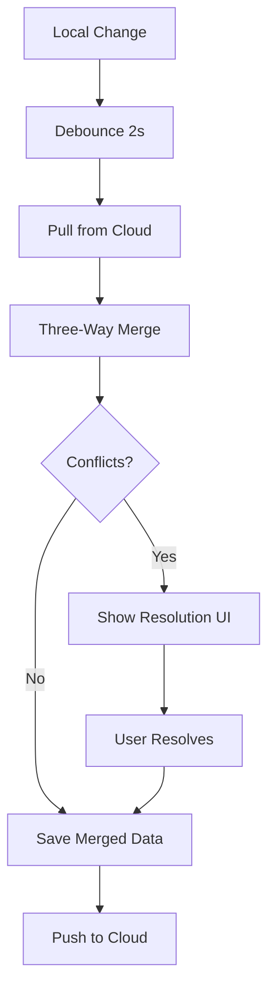

# Git-Style Sync Implementation

## Overview

Your app now uses **Git-style version control** for syncing data between devices, similar to how GitHub handles code collaboration. This prevents data loss when multiple devices edit the same data simultaneously.

## How It Works (Like Git)

### 1. Version Tracking (Like Git Commits)

Every entity (Book, Entry, Category) has:

```typescript
{
  version: number;              // Increments on each edit (like commit count)
  lastModifiedBy?: string;      // User ID who last modified
  lastSyncedVersion?: number;   // Base version for three-way merge
}
```

**Example:**
- Create Book → `version: 1`
- Edit Book name → `version: 2`
- Edit Book description → `version: 3`

### 2. Three-Way Merge (Like Git Merge)

When syncing, we compare **three versions**:

1. **Base** = `lastSyncedVersion` (Common ancestor - last agreed state)
2. **Local** = Your changes on this device
3. **Cloud** = Changes from other devices

```
Timeline:
--------
Base (v1)     "Travel Expenses" | $1000 | "Vacation trip"
    ↓                 ↓                         ↓
Local (v2)    "Travel 2024"     | $1000 | "Vacation trip"  ← You changed name
Cloud (v2)    "Travel Expenses" | $1500 | "Summer vacation" ← Other device changed budget & description
```

### 3. Fast-Forward (Auto-Merge)

**Scenario 1: Only You Changed**
- Base version = Cloud version
- Local version > Base version
- **Result:** Your changes uploaded (like `git push`)

**Scenario 2: Only Other Device Changed**
- Base version = Local version
- Cloud version > Base version
- **Result:** Download their changes (like `git pull`)

**Scenario 3: No Changes**
- All versions match
- **Result:** Nothing to do

### 4. Conflict Detection

**Scenario 4: Both Changed Different Fields**
- You changed: `name: "Travel 2024"`
- They changed: `budget: $1500, description: "Summer vacation"`
- **Result:** Auto-merge (both changes preserved)

**Scenario 5: Both Changed Same Field** ⚠️ CONFLICT
- You changed: `name: "Travel 2024"`
- They changed: `name: "Vacation Budget"`
- **Result:** CONFLICT detected

```
⚠️ Conflict on "name" field:
  Your change:  "Travel 2024"
  Their change: "Vacation Budget"
  
  [Keep Mine] [Use Theirs] [Edit Custom]
```

## Sync Flow (Pull → Merge → Push)



### Code Flow

```typescript
// STEP 1: PULL (Download from cloud)
const cloudData = await downloadFirestoreData(userId);

// STEP 2: GET LOCAL CHANGES
const localBooks = await asyncStorageService.getBooks(userId);

// STEP 3: THREE-WAY MERGE
const { merged, conflicts } = GitStyleSyncService.mergeArrays(
  localBooks,
  cloudBooks,
  'book'
);

// STEP 4: CHECK FOR CONFLICTS
if (conflicts.length > 0) {
  // Show conflict resolution UI
  return { success: false, conflicts };
}

// STEP 5: SAVE & PUSH
await saveDownloadedDataToLocal(userId, merged);
await syncLocalDataToFirestore(userId);
```

## Conflict Structure

```typescript
interface SyncConflict {
  entityType: 'book' | 'entry' | 'category';
  entityId: string;           // Which book/entry/category
  field: string;              // Which field conflicts (e.g., "name")
  baseValue: any;             // Last synced value
  localValue: any;            // Your current value
  cloudValue: any;            // Their current value
  localVersion: number;       // Your version number
  cloudVersion: number;       // Their version number
}
```

## Resolution Options

When conflicts occur, user can choose:

1. **Keep Mine** → Use local value
   ```typescript
   resolutions.set(conflictKey, 'use-local');
   ```

2. **Use Theirs** → Use cloud value
   ```typescript
   resolutions.set(conflictKey, 'use-cloud');
   ```

3. **Edit Custom** → Manual merge
   ```typescript
   resolutions.set(conflictKey, customValue);
   ```

## Real-World Scenarios

### ✅ Scenario 1: Sequential Edits (No Conflict)

**Timeline:**
1. Phone 1: Edit book name → Sync → `version: 2`
2. Phone 2: Download → `lastSyncedVersion: 2`
3. Phone 2: Edit description → Sync → `version: 3`
4. Phone 1: Download → `lastSyncedVersion: 3`

**Result:** All changes preserved, no data loss

### ⚠️ Scenario 2: Simultaneous Edits (Conflict)

**Timeline:**
1. Both phones at `version: 2` (synced)
2. Phone 1: Edit name → "Travel 2024" → `version: 3` (not yet synced)
3. Phone 2: Edit name → "Vacation" → `version: 3` (not yet synced)
4. Phone 1: Sync → Uploads `version: 3` with "Travel 2024"
5. Phone 2: Sync → Detects conflict:
   - Base (v2): "Travel Expenses"
   - Local (v3): "Vacation"
   - Cloud (v3): "Travel 2024"
   - **Both changed same field since base → CONFLICT**

**Resolution:**
- User sees conflict modal
- Chooses "Keep Mine" → "Vacation" wins
- Or "Use Theirs" → "Travel 2024" wins
- Or "Custom" → "Travel & Vacation 2024"

### ✅ Scenario 3: Offline Then Online (No Data Loss)

**Timeline:**
1. Phone 1: Goes offline
2. Phone 1: Creates Book A → `version: 1` (local only)
3. Phone 2: Creates Book B → Syncs → Cloud has Book B
4. Phone 1: Comes online → Syncs
   - Pull: Downloads Book B
   - Merge: Combines Book A (local) + Book B (cloud)
   - Push: Uploads Book A
5. Both phones now have Book A and Book B

**Result:** No data loss, both books exist

### ✅ Scenario 4: Fast-Forward (Auto-Merge)

**Timeline:**
1. Phone 1: Idle (no changes)
2. Phone 2: Edits book → Syncs → `version: 3`
3. Phone 1: Syncs
   - Local version: 2 (no changes since last sync)
   - Cloud version: 3
   - **Fast-forward:** Download cloud version

**Result:** Auto-merge, no conflict

## Implementation Status

### ✅ Completed
- [x] Added version fields to data models (Book, Entry, Category)
- [x] Created `gitStyleSync.ts` service with three-way merge logic
- [x] Integrated Git-style sync into `triggerAutoSync()`
- [x] Added conflict detection
- [x] Pull-before-push flow implemented

### ⏳ In Progress
- [ ] Conflict resolution UI modal
- [ ] Sync status indicator ("Up to date", "Ahead by 2", "Conflicts")
- [ ] Update all CRUD operations to increment version numbers
- [ ] Real-time listener three-way merge integration

### 📋 Testing Needed
- [ ] Test concurrent edits with conflicts
- [ ] Test concurrent edits without conflicts (different fields)
- [ ] Test offline → online sync
- [ ] Test fast-forward scenarios
- [ ] Test version incrementing

## Debugging

### View Sync Logs

All sync operations log detailed information:

```
🔀 Starting Git-style sync: PULL → MERGE → PUSH
📥 PULL: Downloading latest from cloud...
📱 Getting local changes...
🔀 MERGE: Three-way merge (base, local, cloud)...
⚠️ CONFLICTS DETECTED: 3 conflicts need resolution
```

### Check Version Numbers

In debug screen, add:
```typescript
console.log('Book version:', book.version);
console.log('Last synced:', book.lastSyncedVersion);
console.log('Modified by:', book.lastModifiedBy);
```

### Conflict Details

When conflicts occur:
```typescript
{
  entityType: 'book',
  entityId: 'abc123',
  field: 'name',
  baseValue: 'Travel Expenses',    // What it was
  localValue: 'Travel 2024',        // What you changed to
  cloudValue: 'Vacation Budget',    // What they changed to
  localVersion: 3,
  cloudVersion: 3
}
```

## Benefits Over Cloud-First

| Scenario | Cloud-First (Old) | Git-Style (New) |
|----------|------------------|-----------------|
| Concurrent edit same field | ❌ Last write wins, data lost | ✅ Conflict detected, user resolves |
| Concurrent edit different fields | ❌ Last write wins, one lost | ✅ Auto-merge, both preserved |
| Offline then online | ❌ Can overwrite cloud data | ✅ Merge on sync, no loss |
| User control | ❌ No choice | ✅ User resolves conflicts |
| Transparency | ❌ Silent data loss | ✅ Clear conflict messages |

## Next Steps

1. **Test Git-style sync:**
   - Edit same book on two devices
   - Check for conflicts
   - Verify auto-merge for different fields

2. **Build conflict UI:**
   - Show conflicts to user
   - Let user choose resolution
   - Apply resolution and increment version

3. **Add version increment:**
   - Update `asyncStorage.ts` CRUD operations
   - Start new items at `version: 1`
   - Increment on each edit

4. **Add sync status:**
   - Show "Up to date" / "Syncing" / "Conflicts"
   - Git-like status messages

## Comparison to Git

| Git Command | App Equivalent |
|-------------|----------------|
| `git commit` | Edit book/entry (version++) |
| `git pull` | Download from cloud |
| `git merge` | Three-way merge |
| `git push` | Upload to cloud |
| `git status` | Sync status indicator |
| Merge conflict | Conflict resolution UI |
| `merge-base` | `lastSyncedVersion` |
| Commit SHA | `version` number |

Your expense tracking app now works like GitHub! 🎉
